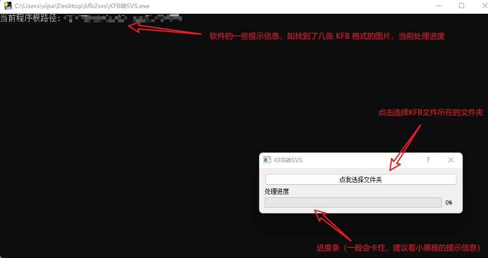

# KFB转SVS软件

软件只是将 [KFB2TiforSVS](https://github.com/WilmerWang/SLFCD/releases/tag/0.0.1) 包装了一下，让本来只能一张一张转换图片格式变成了：

（1）`选择 KFB 文件所在文件夹` 

（2）`批量转换为 SVS 文件`

同时加了一个简陋的GUI 界面，界面截图如下：

GUI 界面包括一个命令行窗口（显示处理过程中的一些信息），一个简单的选择文件夹的按钮和处理进度条界面。

> 上面截图是两个窗口，只是叠放在了一起（为了截图方便）

B站播放链接：https://www.bilibili.com/video/BV1XG411g7vp/

## 参考文献

1. https://zhuanlan.zhihu.com/p/362254790
2. https://github.com/WilmerWang/SLFCD/releases/tag/0.0.1
3. https://zhuanlan.zhihu.com/p/475299807